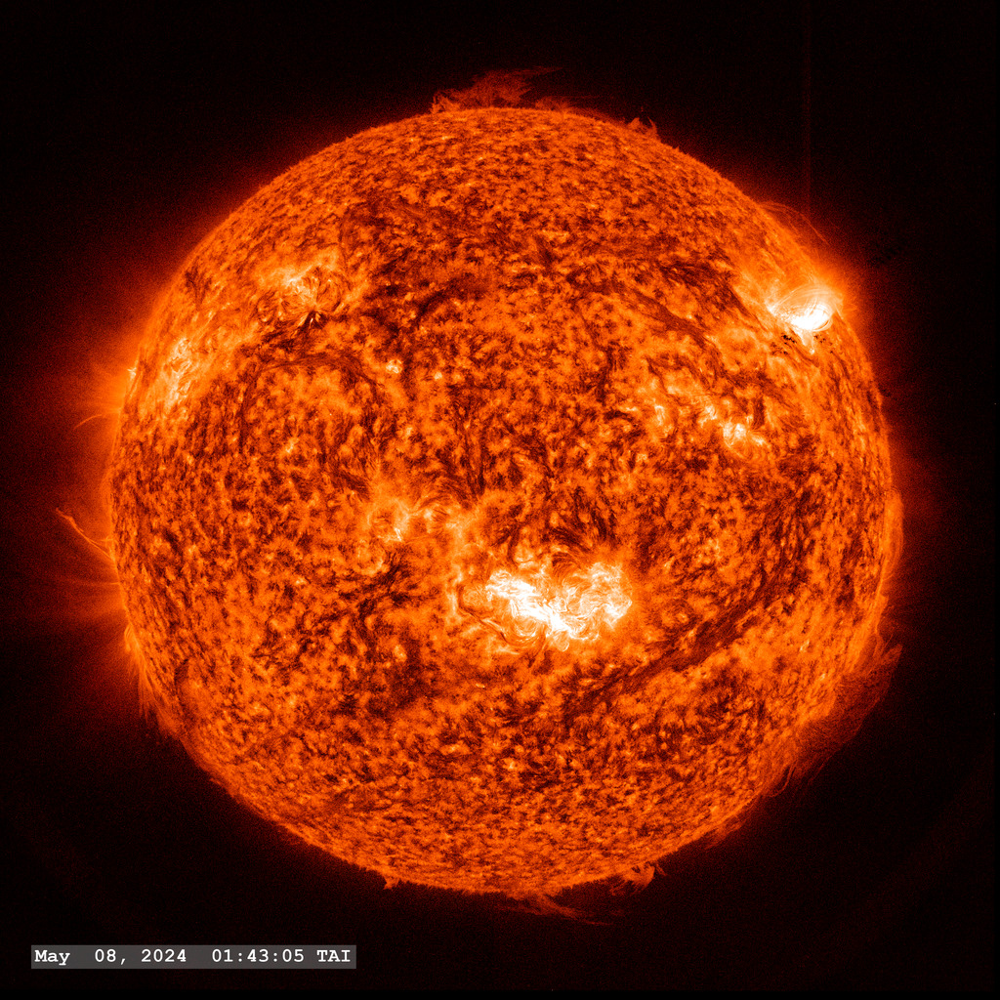

# Predicting Extreme Solar Flares: A New Magnetic Topology Framework
*August 25, 2026 • 3 min read*
**[FEATURED]**

Predicting when and where an extreme solar flare will erupt is one of the most significant challenges in space weather forecasting. Existing methods often struggle, especially when dealing with rapidly reconfiguring active regions that produce recurring X-class flares. 

In our recent work presented at the **44th meeting of the Astronomical Society of India (ASI 2026)**, we introduce a novel approach to tackle this problem head-on by looking beyond static complexity metrics and diving deep into the magnetic topology of active regions.

### Tracking the Precursor: Winding Flux vs. Helicity
We performed an in-depth spatiotemporal analysis of two of the most flare-productive active regions of Solar Cycle 25 (NOAA AR 13664 and AR 13842). Using vector magnetograms from SDO/HMI and EUV data from SDO/AIA, we analyzed the evolution of magnetic helicity, winding flux, and polarity inversion line (PIL) features before and after flares. 

What we discovered was striking: while magnetic helicity flux remains broadly diffused, **magnetic winding flux exhibits systematic, localized increases** near emerging or pre-existing flux-rope structures during the flare precursor stage—sometimes minutes to hours before the eruption.

### The Winding-Flux-Based Masked PIL Framework
Building on this localized signal, we developed a new **winding-flux-based masked PIL framework**. This technique isolates stable and recurrent PIL structures that are directly linked to strong flaring activity. 

By tracking these masked PILs and analyzing the gradient of their most intense segments, we found that we can identify localized trigger regions **3 to 7 hours before a flare ignites**. Remarkably, this method reliably pinpoints flare trigger sites even amid the chaotic, rapid magnetic reconfigurations that follow multiple eruptions.

### What This Means for Space Weather
Our results demonstrate that magnetic winding and winding-based masked PIL metrics are robust, reliable early indicators for extreme solar flares. Because this approach succeeds in regimes where existing forecasting methods struggle (like recurring X-class flares), it offers a promising new pathway for operational space-weather forecasting. We are excited to see how these topological diagnostics can be incorporated into advanced physics-driven and machine-learning prediction models in the near future.

*[Presented at ASI 2026, IIT Guwahati, India](https://astron-soc.in/asi2026)* | **[View on NASA ADS](https://ui.adsabs.harvard.edu/abs/2026asi..confO...6H)**

---

# Welcome to my new website
*August 20, 2026 • 2 min read*

I'm excited to finally launch my new academic homepage! I will be using this blog to post behind-the-scenes thoughts on my latest publications, share updates from my new role as Adjunct Faculty at the University of Nebraska-Lincoln, and write tutorials on light scattering simulations.
